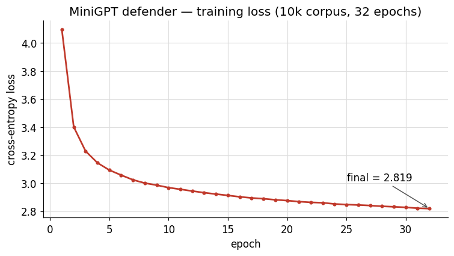
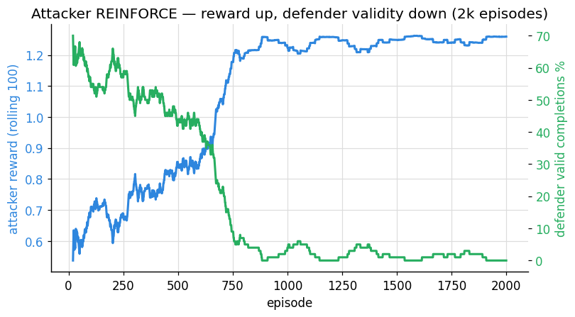
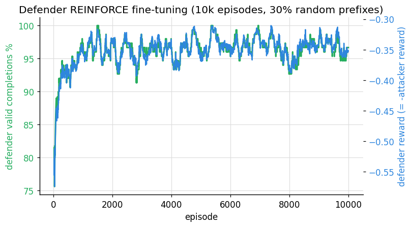
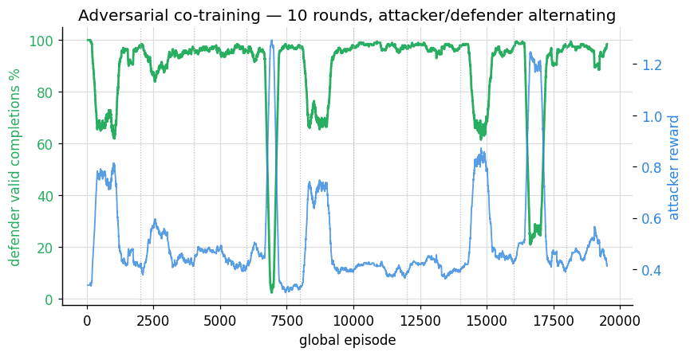

# NLP ადვერსარიული დაცვა — ტექნიკური რეპორტი

ეს დოკუმენტი არის პროექტის **ტექნიკური რეპორტი**. იგი ასაბუთებs ყველა მთავარ
გადაწყვეტილებას და პასუხობს სამ ძირითად მოთხოვნას:

- **§3 — რატომ ავირჩიეთ ეს loss ფუნქცია და მოდელის არქიტექტურა**
- **§4 — როგორ წარიმართა ტრენინგი (გრაფიკებით)**
- **§5 — ევალუაციის ამოცანები, მათი არჩევის მიზეზი და მიღებული შედეგები**

(პროექტის სრული აღწერა, კოდის სტრუქტურა და გაშვების ინსტრუქციები იხილეთ `README.md`-ში.)

---

## 1. პროექტის მიმოხილვა

პროექტი იკვლევს, როგორ იცავს თავს მცირე ენობრივი მოდელი (**დამცველი**) ადვერსარიული
**შემტევის** წინააღმდეგ სრულად კონტროლირებად სინთეზურ ენაში. შემტევი აგენერირებს
გრამატიკულად ვალიდურ წინადადების **პრეფიქსებს**, რომელთა მიზანია დამცველი მიიყვანოს
ან გრამატიკულად **არავალიდურ**, ან თემატურად **გადახრილ** დასასრულამდე. დამცველი
(MiniGPT) ავსებს ამ პრეფიქსებს სრულ წინადადებად.

```
შემტევი ──► CFG-ვალიდური პრეფიქსი ──► MiniGPT (დამცველი) ──► შევსებული წინადადება
                                                                      │
                                                              CFGValidator ამოწმებს
                                                                      │
                                                            RewardFunction აფასებს
                                                                      │
                                                  სკალარული reward ──► REINFORCE (ორივე მხარე)
```

- **შემტევის მიზანი:** ააგოს ისეთი პრეფიქსი, რომელიც დამცველს აიძულებს არასწორი ან
  თემიდან გადახრილი დასასრულის დაწერას.
- **დამცველის მიზანი:** ნებისმიერი პრეფიქსი შეავსოს გრამატიკულად და სემანტიკურად
  ვალიდურ წინადადებად.
- **ერთი reward, საპირისპირო ნიშნით:** შემტევი მაქსიმუმამდე ზრდის `R`-ს, დამცველი —
  `−R`-ს.

**რატომ სინთეზური ენა?** იმიტომ, რომ ვალიდურობა ხდება **ბინარული და ობიექტურად
გაზომვადი** — არ არსებობს ბუნდოვანება, არ სჭირდება ხელით ანოტირება და არ არის
დამოკიდებული წინასწარ ნაწვრთნ რესურსებზე. სწორედ ეს იძლევა სუფთა, რაოდენობრივი
პასუხის გაცემის შესაძლებლობას ატაკის წარმატებასა და დაცვის მდგრადობაზე.

---

## 2. სინთეზური ენა (მოკლე კონტექსტი)

ლექსიკონი: **69 არსებითი სახელი, 32 ზმნა, 41 ზედსართავი**. ყოველ სიტყვას აქვს ორი
სემანტიკური თვისება:

- **ტეგები** — დისკრეტული კატეგორიული ნიშნულები (მაგ. `MAN → {ALIVE, HUMAN}`).
- **ღერძული მნიშვნელობები (axis)** — 4-განზომილებიანი ნამდვილრიცხვა ვექტორი:
  `agency` (მოქმედების უნარი), `physicality` (ფიზიკურობა), `social` (სოციალურობა),
  `system` (მანქანურობა), თითოეული დიაპაზონში 0–5.

გრამატიკა (context-free ჩონჩხი):

```
START        → SUBJECT_TERM
SUBJECT_TERM → SUBJECT VERB_TERM
SUBJECT      → NOUN | ADJ NOUN
VERB_TERM    → VERB | VERB OBJECT | VERB VERB_TERM | VERB OBJECT VERB_TERM
OBJECT       → NOUN | ADJ NOUN | ADJ ADJ NOUN
```

ჩონჩხს ემატება **სემანტიკური შეზღუდვები**: ყოველი ზმნა მოითხოვს, რომ მისი ქვემდებარე
(და გარდამავალი ზმნის შემთხვევაში — დამატებაც) აკმაყოფილებდეს ტეგების გადაფარვისა და
axis-დიაპაზონის შეზღუდვებს.

- ვალიდური მაგალითები: `MAN RUN` · `FREE WOLF FALL` · `DRONE BREAK CLOCK`
- არავალიდური მაგალითი: `RIVER BURN` → *„ზმნა 'BURN' შეუთავსებელია ქვემდებარე 'RIVER'-თან“*

---

## 3. არქიტექტურისა და loss ფუნქციის არჩევანის დასაბუთება

*(მოთხოვნა 1 — მოდელის არქიტექტურისა და loss ფუნქციის დასაბუთება.)*

### 3.1 რატომ decoder-only კაუზალური Transformer

ძირითადი ამოცანა არის **ავტორეგრესიული გენერაცია**: წინადადების აგება/შევსება
მარცხნიდან მარჯვნივ. GPT-ტიპის decoder-only Transformer ამისთვის ბუნებრივი არჩევანია —
ის წინ მდგარი ყველა ტოკენიდან წინასწარმეტყველებს მომდევნო ტოკენს კაუზალური ნიღბის ქვეშ.
მოდელი შეგნებულად **მცირეა**:

| ჰიპერპარამეტრი | მნიშვნელობა | მიზეზი |
|---|---|---|
| ფენები | 4 | ენას აქვს 146 ტოკენი და არაღრმა CFG; მეტი სიღრმე ზედმეტია. |
| ჩაშენების განზომილება | 64 | საკმარისი 146 ტოკენისა და პოზიციების გასაყოფად; საკმარისად მცირე CPU-ზე წვრთნისთვის. |
| ყურადღების თავები | 4 | head_dim = 16, სტანდარტული გაყოფა. |
| კონტექსტის სიგრძე | 32 | ყველაზე გრძელი ვალიდური წინადადებაც კი 32 ტოკენზე ნაკლებია. |
| FFN განზომილება | 256 | ჩვეულებრივი 4× გაფართოება. |
| Dropout | 0.1 | მსუბუქი რეგულარიზაცია. |
| წონების გაზიარება (weight tying) | კი | შესასვლელი ჩაშენება = გამოსასვლელი პროექცია → ნაკლები პარამეტრი. |
| **სულ პარამეტრი** | **210,432** | მცირე, სწრაფი, ძნელად გადააწვრთნადი კონტროლირებად ენაზე. |

**რატომ აქვს შემტევსა და დამცველს იდენტური არქიტექტურა.** ორივე არის 210k-პარამეტრიანი
MiniGPT. თანაბარი ტევადობა ექსპერიმენტს აქცევს **სასწავლო სიგნალის** სუფთა ტესტად: თუ
შემტევი იმარჯვებს, ეს მისი პოლისის დამსახურებაა და არა იმის, რომ ის უფრო დიდი მოდელია.

**რატომ CFG-ნიღბვა შემტევზე.** შემტევმა ტევადობა არ უნდა დახარჯოს გრამატიკის ხელახლა
სწავლაში, რომელსაც `CFGStateTracker` უკვე უზრუნველყოფს. ყოველ ნაბიჯზე გრამატიკულად
დაუშვებელი ტოკენების ლოგიტები ნიღბდება `−∞`-მდე შერჩევამდე, ამიტომ პოლისი ალბათობას
ანაწილებს მხოლოდ **ვალიდურ** მოქმედებებზე და სწავლობს მთავარს: *რომელი* ვალიდური
პრეფიქსი იწვევს ცუდ დასასრულს.

### 3.2 რატომ ორი განსხვავებული loss ფუნქცია

პროექტს აქვს **ორი განსხვავებული სასწავლო ამოცანა**, და თითოეულს სჭირდება სწორი მიზანი.

**(ა) დამცველის წინასწარი წვრთნა → ტოკენ-დონის cross-entropy.**
MiniGPT-ის წვრთნა ენაზე „სალაპარაკოდ“ არის ჩვეულებრივი maximum-likelihood ენობრივი
მოდელირება, ამიტომ ვიყენებთ მომდევნო-ტოკენის cross-entropy-ს padding-ის იგნორირებით:

```python
criterion = nn.CrossEntropyLoss(ignore_index=tokenizer.pad_id)
loss = criterion(logits.reshape(-1, V), targets.reshape(-1))
```

`ignore_index=pad_id` უზრუნველყოფს, რომ padding ტოკენები არ აძლევდნენ წვლილს გრადიენტში.
cross-entropy არის სტანდარტული, კარგად ქცევადი MLE მიზანი ავტორეგრესიული მოდელებისთვის —
არაფერი ეგზოტიკური არ არის საჭირო.

**(ბ) ადვერსარიული წვრთნა → REINFORCE policy gradient.**
ადვერსარიული reward დამოკიდებულია (i) **CFG ვალიდატორის** ბინარულ ვერდიქტზე და
(ii) **დისკრეტულად შერჩეულ ტოკენებზე**. არცერთი არ არის დიფერენცირებადი — ვერ გაატარებ
გრადიენტს ვერც მკაცრ ვალიდურობის შემოწმებაში, ვერც `argmax`/შერჩევაში. ამიტომ
**მოსალოდნელი reward-ის** გრადიენტს ვაფასებთ REINFORCE (score-function) შემფასებლით:

```
advantage = R − baseline                   # baseline = ბოლო reward-ების EMA
loss      = −(advantage × Σ log π(aₜ))      # შერჩეული ტოკენების log-ალბათობების ჯამი
loss.backward()
```

REINFORCE-ის შიგნით მიღებული გადაწყვეტილებები და მათი მიზეზი:

| არჩევანი | მიზეზი |
|---|---|
| **EMA baseline** | REINFORCE-ის გრადიენტი მაღალ-დისპერსიულია. reward-ის მცოცავი საშუალოს გამოკლება (`baseline_alpha = 0.05`) აცენტრებს advantage-ს და ასტაბილურებს სწავლას ცალკე კრიტიკოსის გარეშე. |
| **ენტროპიის ბონუსი** (`−β·H`) | სუფთა REINFORCE იყრის თავს ერთ მაღალ-reward-იან პრეფიქსზე (mode collapse). ენტროპიის წევრი პოლისს ინარჩუნებს გაშლილს. |
| **გრადიენტის წაკვეთა** (1.0) | ზღუდავს იშვიათ, ძალიან დიდ policy-gradient ნაბიჯებს. |
| **დამცველის reward = −შემტევის reward** | ნულოვან-ჯამიანი ჩარჩო: ერთივე სკალარი წვრთნის ორივე მხარეს, ისინი პირდაპირ ერთმანეთის წინააღმდეგ ოპტიმიზდებიან. |

### 3.3 reward ფუნქცია (სისტემის გული)

ერთი სტრუქტურირებული reward აფასებს ყოველ ურთიერთქმედებას. ის ახდენს **სამდონიანი
პრიორიტეტის** კოდირებას: გრამატიკული მარცხი ≫ თემატური შეუსაბამობა ≫ თემატური გადახრა.

```
R = w_grammar · grammar_reward      # 1.0 თუ CFG-არავალიდურია, თუ არა — 0.0
  + w_tag     · tag_mismatch        # 3 POS-ის (noun/verb/adj) Jaccard-მანძილების საშუალო
  + w_axis    · axis_distance       # axis-ვექტორების საშუალოს კოსინუსური მანძილი
```

| წონა | მნიშვნელობა | როლი |
|---|---|---|
| `w_grammar` | 1.0 | გრამატიკული მარცხი დომინირებს — შემტევის ყველაზე დიდი მოგება. |
| `w_tag` | 0.30 | ტეგების შეუსაბამობა — საშუალო სიგნალი. |
| `w_axis` | 0.20 | axis-გადახრა — საშუალო სიგნალი. |
| **მაქს. R** | **1.50** | სამივე კომპონენტი = 1.0 ერთდროულად. |

**რატომ POS-ის მიხედვით დაყოფილი ტეგ-მანძილები** (noun / verb / adj ცალ-ცალკე და არა
ერთ გაერთიანებულ სიმრავლეში): ეს გვეუბნება, *რომელი* გრამატიკული სლოტი გადაიხარა, რაც
გაცილებით უფრო გამოსადეგია როგორც ანალიზისთვის, ისე სასწავლო სიგნალად. **რატომ
უწყვეტი axis-წევრი დისკრეტული ტეგების გარდა:** ორ სიტყვას შეიძლება საერთო ტეგი არ
ჰქონდეს, მაგრამ სემანტიკურად ახლოს იყოს (ან პირიქით); axis-ვექტორებზე კოსინუსური მანძილი
იჭერს ამ თანდათანობით გადახრას, რომელსაც მხოლოდ Jaccard ვერ ხედავს. ამ შეფასებითი
ფორმირების წყალობით შემტევს აქვს გლუვი გრადიენტი ასასვლელად იმ ეპიზოდებშიც, სადაც ჯერ
სრული გრამატიკული მარცხი არ მიუღწევია.

reward-ის დონეების მაგალითები:

| შემთხვევა | grammar | tag | axis | სულ R |
|---|---|---|---|---|
| გრამატიკული მარცხი | 1.00 | ~0.20 | ~0.01 | **~1.21** |
| თემატური შეუსაბამობა | 0.00 | ~0.20 | ~0.08 | **~0.28** |
| თემატურად თანმიმდევრული | 0.00 | ~0.10 | ~0.00 | **~0.10** |

---

## 4. ტრენინგი: როგორ წარიმართა, გრაფიკებით

*(მოთხოვნა 2 — ტრენინგის პროცესი, ილუსტრირებული.)*

ქვემოთ მოცემული ყველა გრაფიკი დაგენერირებულია უშუალოდ `logs/`-ში არსებული CSV
ლოგებიდან ბრძანებით `python scripts/plot_report_figures.py`.

### 4.1 დამცველის წინასწარი წვრთნა (cross-entropy)

MiniGPT ნაწვრთნია 10,000-წინადადებიან კორპუსზე 32 ეპოქის განმავლობაში (AdamW, lr 3e-4,
batch 64, grad-clip 1.0). Loss მკვეთრად ეცემა პირველ ~5 ეპოქაში, შემდეგ გადადის გლუვ
კლებაში — მოსალოდნელი MLE მრუდი, დივერგენციისა და გადააწვრთნის ნიშნების გარეშე.



- Loss: **4.095 → 2.819** (დასაწყისი → 32-ე ეპოქა); საუკეთესო გუნდური checkpoint: **2.79**.
- შედეგი: დამცველი საიმედოდ აგენერირებს გრამატიკულ, თემაში მყოფ წინადადებებს — კარგი
  საბაზისო ოპონენტი შემტევისთვის.

### 4.2 შემტევის REINFORCE (გაყინული დამცველის წინააღმდეგ)

შემტევის პოლისი ნაწვრთნია REINFORCE-ით გაყინული დამცველის წინააღმდეგ. ქვემოთ ორი მრუდი
ერთი და იმავე გაშვებიდანაა (2,000 ეპიზოდი, EMA baseline): როცა შემტევის **reward იზრდება**,
დამცველის **ვალიდური დასასრულების მაჩვენებელი ვარდება** — პირდაპირი მტკიცებულება, რომ
შემტევი სწავლობს დამცველის გატეხვას.



- საშუალო reward: **0.56 → 1.26**; გრამატიკული მარცხის მაჩვენებელი: **0.32 → 1.00**.
- სუფთა გადაკვეთა ~700-ე ეპიზოდთან, სადაც შემტევი აღმოაჩენს პრეფიქს-ფორმებს, რომლებიც
  თითქმის ყოველთვის აიძულებენ სემანტიკურ დარღვევას.
- გუნდის უფრო გრძელმა 20k-ეპიზოდიანმა გაშვებამ (`attacker_best.pt`) მიაღწია
  **საშუალო reward ≈ 1.31**.

### 4.3 დამცველის REINFORCE დახვეწა (გაყინული შემტევის წინააღმდეგ)

შემდეგ დამცველი დავხვეწეთ REINFORCE-ით (reward = −შემტევის reward) 10,000 ეპიზოდის
განმავლობაში. მნიშვნელოვანია, რომ პრეფიქსების **30% შემთხვევით აიღება** CFG-დან და არა
mode-collapsed შემტევისგან, რათა დამცველი განაზოგადებდეს და არ იზეპირებდეს ერთ ექსპლოიტს.



- დამცველის ვალიდურობის მაჩვენებელი: **~76% → ~96%** და ნარჩუნდება; reward იზრდება
  ~−0.55-დან ~−0.34-მდე.
- დახვეწილი დამცველი ასწორებს კონკრეტულ სისუსტეებს, რომლებსაც შემტევი იყენებდა, და
  ამავდროულად ინარჩუნებს ზოგად მდგრადობას მთელ გრამატიკაზე.

### 4.4 ადვერსარიული co-training (მონაცვლეობითი)

ბოლოს, ორივე მხარე ივარჯიშებს მონაცვლეობით ფაზებში
(`scripts/train/train_adversarial.py`): ყოველი რაუნდი = X შემტევის ეპიზოდი (დამცველი
გაყინული), შემდეგ X დამცველის ეპიზოდი (შემტევი გაყინული), რასაც მოჰყვება გაყინული
პირისპირ შეფასება. გრაფიკი აჩვენებs **შეიარაღების რბოლას**: დამცველის ვალიდურობა (მწვანე)
ეცემა ყოველ შემტევის ფაზაში და აღდგება ყოველ დამცველის ფაზაში.



- ღრმა, ვიწრო პიკები არის მომენტები, როცა შემტევი მოკლედ აღმოაჩენს ახალ ექსპლოიტს, სანამ
  დამცველი მომდევნო ფაზაში მოერგება.
- ჩაშენებული გაკვეთილები: შემტევის ფაზები იყენებენ **ენტროპიის ბონუსს** (mode-collapse-ის
  წინააღმდეგ); დამცველის ფაზები **ურევენ შემთხვევით პრეფიქსებს** (დავიწყების წინააღმდეგ);
  state tracker უზრუნველყოფს, რომ ყოველი პრეფიქსი პასუხგაცემადია, ასე რომ ვერცერთი მხარე
  ვერ „მოიგებს“ ჩიხის ხარჯზე.

> **ცნობილი დინამიკა (გულწრფელი შენიშვნა).** co-training-ის ვალიდურობა **ხტუნავს** — ის
> იწყება მაღლა და ძლიერ ოსცილირებს ყოველ რაუნდში. ეს თანდაყოლილია მონაცვლეობით REINFORCE-ში
> გაყინული ოპონენტით: მოვარჯიშე მხარე გადააჭარბებს ოპტიმიზაციას სტატიკური სამიზნის
> წინააღმდეგ. ამას ვამცირებთ ენტროპიის ბონუსით, შემთხვევითი პრეფიქსების შერევით და
> **ადრეული გაჩერებით** (early-stop), რომელიც ამთავრებს შემტევის ფაზას, როცა მისი
> ვალიდურობა ზღურბლს ჩამოსცდება (რათა დამცველი უფრო მალე მოერგოს). უფრო გლუვ მრუდს
> დასჭირდებოდა ნაკლები learning rate ან ჭეშმარიტი ერთდროული განახლებები.

---

## 5. ევალუაცია: ამოცანები, დასაბუთება და შედეგები

*(მოთხოვნა 3 — რას ვაფასებთ, რატომ და რა რიცხვებით.)*

**რატომ ეს მეტრიკები.** სინთეზური ენა სწორედ იმისთვის ავირჩიეთ, რომ **ვალიდურობა იყოს
ჭეშმარიტი ნიშნული (ground-truth)**: `CFGValidator` ნებისმიერი წინადადებისთვის იძლევა
ზუსტ ვალიდურ/არავალიდურ ვერდიქტს ანოტირების გარეშე. ამიტომ *ვალიდურობის მაჩვენებელი*
არის ჩვენი ძირითადი, ცალსახა მეტრიკა, ხოლo *საშუალო reward* — მეორეული მეტრიკა, რადგან
ის იჭერს თანდათანობით სემანტიკურ გადახრასაც კი მაშინ, როცა წინადადება ტექნიკურად
ვალიდურია. ყველა პირისპირ შეფასებაში **ორივე მოდელი იყინება**, ასე რომ ვზომავთ პოლისის
ხარისხს და არა მცოცავ სამიზნეს.

### ამოცანა 1 — დამცველის ენობრივი მოდელირების ხარისხი
*კითხვა:* მართლა „ლაპარაკობს“ თუ არა წინასწარ ნაწვრთნი დამცველი ენაზე?
*მეტრიკა:* წვრთნის cross-entropy + თავისუფალი გენერაციების CFG-ვალიდურობა.
*შედეგი:* loss **2.82**; თავისუფალი ნიმუშები სტაბილურად გრამატიკული და თემაშია.

### ამოცანა 2 — ატაკის წარმატება (REINFORCE-მდე vs. შემდეგ)
*კითხვა:* REINFORCE რეალურად აუმჯობესებს თუ არა შემტევის უნარს, გატეხოს დამცველი?
*მეტრიკა:* დამცველის ვალიდურობა და შემტევის საშუალო reward **ერთი და იმავე** გაყინული
დამცველის წინააღმდეგ, იგივე ტემპერატურებით, იგივე `min_completion_tokens=1` წესით,
**n = 100,000** ეპიზოდზე.

| მეტრიკა | უწვრთნელი შემტევი | ნაწვრთნი `attacker_best.pt` | Δ |
|---|---|---|---|
| ვალიდური დასასრულები | 44,898 / 100k (**44.9%**) | 5,295 / 100k (**5.3%**) | **−39.6 პუნქტი** |
| არავალიდური დასასრულები | 55,102 / 100k (**55.1%**) | 94,705 / 100k (**94.7%**) | **+39.6 პუნქტი** |
| საშუალო reward | **0.814** | **1.312** | **+0.50 (≈1.6×)** |

*ინტერპრეტაცია:* უწვრთნელი შემტევი გამოსცემს ~ერთგვაროვან ვალიდურ პრეფიქსებს და დამცველი
„გადარჩება“ ~45% შემთხვევაში; წვრთნის შემდეგ შემტევი იყრის თავს იმ პრეფიქს-ფორმებზე,
რომლებიც ~95% შემთხვევაში აიძულებენ სემანტიკურ დარღვევას. ლოგირებულია DagsHub-ზე
`AttackBenchmark`-ის ქვეშ.

### ამოცანა 3 — დამცველის მდგრადობა RL-დახვეწის შემდეგ
*კითხვა:* შეიძლება თუ არა დამცველი გავამაგროთ ნაწვრთნი შემტევის წინააღმდეგ ისე, რომ
დანარჩენი ენა არ დაივიწყოს?
*მეტრიკა:* ვალიდურობა შემტევის პრეფიქსების **და** შემთხვევითი CFG პრეფიქსების წინააღმდეგ.
*შედეგი:* ვალიდურობა **~76% → ~96%**; განზოგადება დასტურდება შემთხვევითი პრეფიქსების
შერევით (ვალიდურობა მაღალი რჩება იმ პრეფიქსებზეც, რომლებსაც შემტევი არ იყენებს).

### ამოცანა 4 — co-training-ის დინამიკა
*კითხვა:* რა ხდება, როცა ორივე მხარე ეგუება ერთმანეთს?
*მეტრიკა:* რაუნდ-ზე-რაუნდ გაყინული პირისპირ ვალიდურობა.
*შედეგი:* ოსცილირებადი წონასწორობა; რაუნდის **ბოლოს** (დამცველის ფაზის შემდეგ) დამცველი
ინარჩუნებს **~95–99%** ვალიდურობას, ანუ რჩება წინ რაუნდებს შორის, სანამ შემტევი აგრძელებს
ცდას.

---

## 6. პრობლემები და მათი გადაჭრა

| # | პრობლემა | ძირეული მიზეზი | გადაწყვეტა |
|---|---|---|---|
| 1 | **შემტევის mode collapse** — პოლისი იყრიდა თავს ერთ პრეფიქსზე (`FAMOUS HOME`, `CITY …`). | სუფთა REINFORCE აჯილდოებს ერთი საუკეთესო ექსპლოიტის ექსპლუატაციას. | დაემატა **ენტროპიის ბონუსი** შემტევის loss-ში; co-training-ში — **ადრეული გაჩერება**, როცა ვალიდურობა ვარდება. |
| 2 | **პასუხგაუცემელი ჩიხ-პრეფიქსები** — 11 არსებით სახელს (CITY, HOME, FOREST …) აქვს *ნული* თავსებადი ზმნა. | გრამატიკა უშვებდა მარტო ქვემდებარეს, რომელსაც ვერცერთი ზმნა ვერ იღებდა. | `CFGStateTracker._precompute_viability()` ჭრის ჩიხამდე მიმავალ ქვემდებარეებს/ზედსართავებს, ასე რომ ყოველი შემოთავაზებული პრეფიქსი **შევსებადია**. |
| 3 | **დამცველის დავიწყება** RL-ის დროს — ეგუებოდა collapsed შემტევის ერთ პრეფიქსს. | წვრთნა მხოლოდ დეგენერირებულ პრეფიქს-განაწილებაზე. | **30% შემთხვევითი CFG პრეფიქსის შერევა** (`--mix-random 0.3`), რათა დამცველი დარჩეს ზოგადი. |
| 4 | **გრამატიკის ცვლილება** — დაემატა `VERB_TERM → VERB VERB_TERM` (ზმნათა ჯაჭვი, მაგ. `MAN RUN FALL`). | ახალმა წესმა გააუქმა კორპუსი, ნაწვრთნი დამცველი და state machine. | ხელახლა დაგენერირდა კორპუსი, **ხელახლა ნაწვრთნი** დამცველი და განახლდა `CFGStateTracker`. |
| 5 | **DagsHub 401 ავთენტიფიკაცია** + **DagsHub-ის გათიშვა**. | DagsHub-ს სჭირდება token როგორც MLflow-ს მომხმარებლადაც **და** პაროლადაც; სერვერი ხანდახან მიუწვდომელია. | token იგზავნება user+pass-ად; ნებისმიერი შეცდომისას **გადართვა ლოკალურ MLflow-ზე** (`mlruns/`). |
| 6 | **Windows-ის ავარია** — OpenMP `libiomp5md.dll` კონფლიქტი და `cp1252` Unicode შეცდომები. | PyTorch-ის OMP ორმაგი ჩატვირთვა; კონსოლი ვერ აკოდირებს სპეც-სიმბოლოებს. | `KMP_DUPLICATE_LIB_OK=TRUE` ყოველ შემავალ სკრიპტში; non-ASCII გამოტანის ASCII-თ ჩანაცვლება. |
| 7 | **არეული არქიტექტურა** — reward კოდი `src/attacker/`-ში, დამცველი იმპორტავდა *ზევით* attacker-ში; დუბლირებული `train_model.py`. | ორგანული ზრდა. | გამოიყო **`src/reward/`** გაზიარებული პაკეტი; სკრიპტები დაჯგუფდა `train/ eval/ data/ demo/ downloads/`-ად; დუბლი წაიშალა. ყველა 269 ტესტი გადის. |

---

*დამატებითი დეტალები (კოდის სტრუქტურა, კომპონენტების ცნობარი, გაშვების ბრძანებები,
ტესტები, MLflow/DagsHub-ის კონფიგურაცია) იხილეთ `README.md`-ში.*
